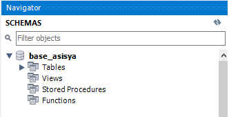
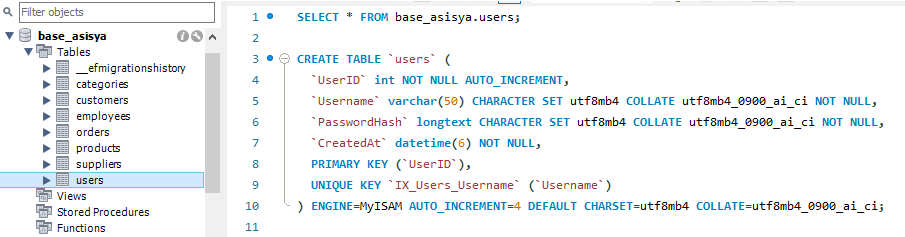
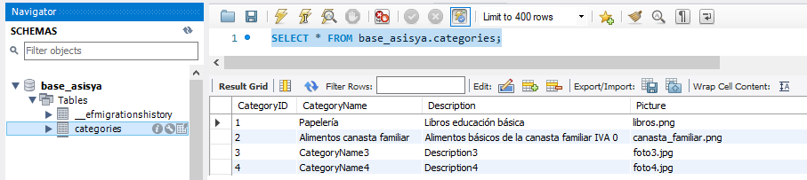
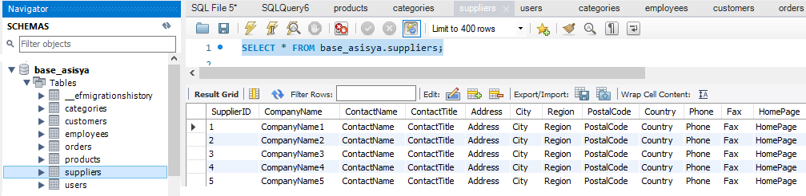
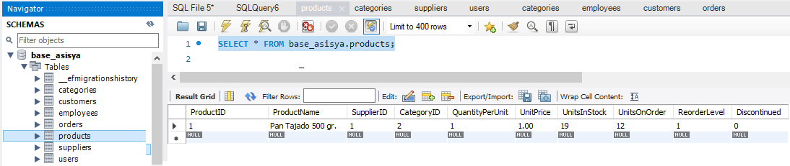
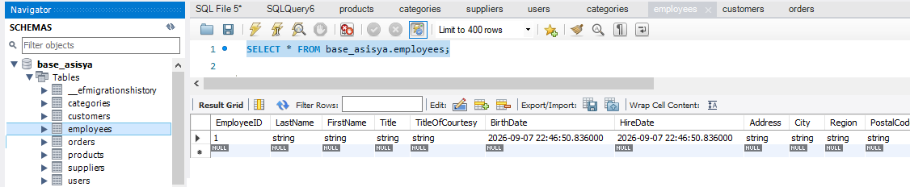
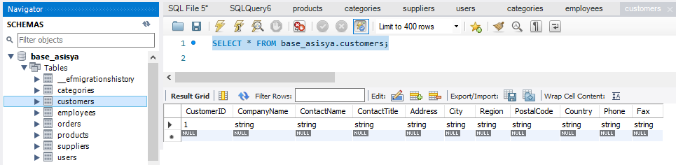
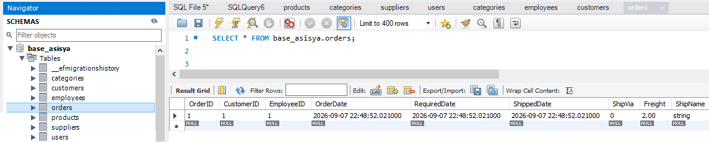

# ASISYA · Frontend

A continuación se encuentran los pasos a seguir para la creación de la base de datos MySQL seleccionada.

## Scripts para creación de base de datos

BASE DE DATOS: base_asisya

Creación y uso de la base de datos en MySQL.

```

-- Crea la base de datos si no existe
CREATE DATABASE IF NOT EXISTS base_asisya;

-- Selecciona la base de datos para usarla
USE base_asisya;

```




Se requiere el siguiente comando para pruebas:

```
SET GLOBAL local_infile = 1;
```

- SET GLOBAL: Cambia una variable de configuración a nivel global para todo el servidor MySQL mientras esté encendido.local_infile: Es la variable de sistema que controla si se permite o rechaza la lectura de archivos locales que envía el cliente.= 1: 
Asigna el valor 1 (verdadero o encendido), lo que activa o permite dicha función. Por defecto suele estar desactivada (0) por motivos de seguridad.

- Se utiliza comúnmente cuando necesitas importar grandes cantidades de datos desde un archivo guardado en tu computadora hacia una tabla de una base de datos MySQL, y recibes un error indicando que la carga de datos locales está deshabilitada.

- Para que funcione por completo, recuerda que también debes habilitar esta opción en el programa cliente con el que te conectas a MySQL (añadiendo --local-infile=1 en la conexión)
 


A continuación se visualizan los scripts para la creación de las tablas necesarias para el proyecto.

# TABLA: users

```

CREATE TABLE `users` (
  `UserID` int NOT NULL AUTO_INCREMENT,
  `Username` varchar(50) CHARACTER SET utf8mb4 COLLATE utf8mb4_0900_ai_ci NOT NULL,
  `PasswordHash` longtext CHARACTER SET utf8mb4 COLLATE utf8mb4_0900_ai_ci NOT NULL,
  `CreatedAt` datetime(6) NOT NULL,
  PRIMARY KEY (`UserID`),
  UNIQUE KEY `IX_Users_Username` (`Username`)
);

```



En esta se utiliza para los usuarios registrados a través del API, o con el uso de la aplicación frontend.


```
{ 
    "username": "admin", 
    "password": "admin123" 
}
```


# TABLA: categories

```

CREATE TABLE `categories` (
  `CategoryID` int NOT NULL AUTO_INCREMENT,
  `CategoryName` varchar(50) CHARACTER SET utf8mb4 COLLATE utf8mb4_0900_ai_ci NOT NULL,
  `Description` varchar(255) CHARACTER SET utf8mb4 COLLATE utf8mb4_0900_ai_ci DEFAULT NULL,
  `Picture` varchar(255) CHARACTER SET utf8mb4 COLLATE utf8mb4_0900_ai_ci DEFAULT NULL,
  PRIMARY KEY (`CategoryID`)
);


```




# TABLA: suppliers

```

CREATE TABLE `suppliers` (
  `SupplierID` int NOT NULL AUTO_INCREMENT,
  `CompanyName` varchar(100) CHARACTER SET utf8mb4 COLLATE utf8mb4_0900_ai_ci NOT NULL,
  `ContactName` varchar(100) CHARACTER SET utf8mb4 COLLATE utf8mb4_0900_ai_ci DEFAULT NULL,
  `ContactTitle` varchar(50) CHARACTER SET utf8mb4 COLLATE utf8mb4_0900_ai_ci DEFAULT NULL,
  `Address` varchar(150) CHARACTER SET utf8mb4 COLLATE utf8mb4_0900_ai_ci DEFAULT NULL,
  `City` varchar(50) CHARACTER SET utf8mb4 COLLATE utf8mb4_0900_ai_ci DEFAULT NULL,
  `Region` varchar(50) CHARACTER SET utf8mb4 COLLATE utf8mb4_0900_ai_ci DEFAULT NULL,
  `PostalCode` varchar(20) CHARACTER SET utf8mb4 COLLATE utf8mb4_0900_ai_ci DEFAULT NULL,
  `Country` varchar(50) CHARACTER SET utf8mb4 COLLATE utf8mb4_0900_ai_ci DEFAULT NULL,
  `Phone` varchar(50) CHARACTER SET utf8mb4 COLLATE utf8mb4_0900_ai_ci DEFAULT NULL,
  `Fax` varchar(50) CHARACTER SET utf8mb4 COLLATE utf8mb4_0900_ai_ci DEFAULT NULL,
  `HomePage` varchar(255) CHARACTER SET utf8mb4 COLLATE utf8mb4_0900_ai_ci DEFAULT NULL,
  PRIMARY KEY (`SupplierID`)
) 

```




# TABLA: products

```

CREATE TABLE `products` (
  `ProductID` int NOT NULL AUTO_INCREMENT,
  `ProductName` varchar(100) CHARACTER SET utf8mb4 COLLATE utf8mb4_0900_ai_ci NOT NULL,
  `SupplierID` int DEFAULT NULL,
  `CategoryID` int NOT NULL,
  `QuantityPerUnit` varchar(50) CHARACTER SET utf8mb4 COLLATE utf8mb4_0900_ai_ci DEFAULT NULL,
  `UnitPrice` decimal(18,2) DEFAULT NULL,
  `UnitsInStock` smallint DEFAULT NULL,
  `UnitsOnOrder` smallint DEFAULT NULL,
  `ReorderLevel` smallint DEFAULT NULL,
  `Discontinued` tinyint(1) NOT NULL,
  PRIMARY KEY (`ProductID`),
  KEY `IX_Products_CategoryID` (`CategoryID`),
  KEY `IX_Products_SupplierID` (`SupplierID`)
)

```




# TABLA: employees

```

CREATE TABLE `employees` (
  `EmployeeID` int NOT NULL AUTO_INCREMENT,
  `LastName` varchar(20) CHARACTER SET utf8mb4 COLLATE utf8mb4_0900_ai_ci NOT NULL,
  `FirstName` varchar(10) CHARACTER SET utf8mb4 COLLATE utf8mb4_0900_ai_ci NOT NULL,
  `Title` varchar(30) CHARACTER SET utf8mb4 COLLATE utf8mb4_0900_ai_ci DEFAULT NULL,
  `TitleOfCourtesy` varchar(25) CHARACTER SET utf8mb4 COLLATE utf8mb4_0900_ai_ci DEFAULT NULL,
  `BirthDate` datetime(6) DEFAULT NULL,
  `HireDate` datetime(6) DEFAULT NULL,
  `Address` varchar(60) CHARACTER SET utf8mb4 COLLATE utf8mb4_0900_ai_ci DEFAULT NULL,
  `City` varchar(15) CHARACTER SET utf8mb4 COLLATE utf8mb4_0900_ai_ci DEFAULT NULL,
  `Region` varchar(15) CHARACTER SET utf8mb4 COLLATE utf8mb4_0900_ai_ci DEFAULT NULL,
  `PostalCode` varchar(10) CHARACTER SET utf8mb4 COLLATE utf8mb4_0900_ai_ci DEFAULT NULL,
  `Country` varchar(15) CHARACTER SET utf8mb4 COLLATE utf8mb4_0900_ai_ci DEFAULT NULL,
  `HomePhone` varchar(24) CHARACTER SET utf8mb4 COLLATE utf8mb4_0900_ai_ci DEFAULT NULL,
  `Extension` varchar(4) CHARACTER SET utf8mb4 COLLATE utf8mb4_0900_ai_ci DEFAULT NULL,
  `Photo` longblob,
  `Notes` longtext CHARACTER SET utf8mb4 COLLATE utf8mb4_0900_ai_ci,
  `ReportsTo` int DEFAULT NULL,
  PRIMARY KEY (`EmployeeID`),
  KEY `IX_Employees_LastName_FirstName` (`LastName`,`FirstName`),
  KEY `IX_Employees_PostalCode` (`PostalCode`),
  KEY `IX_Employees_ReportsTo` (`ReportsTo`)
);

```




# TABLA: customers

```

CREATE TABLE `customers` (
  `CustomerID` int NOT NULL AUTO_INCREMENT,
  `CompanyName` varchar(40) CHARACTER SET utf8mb4 COLLATE utf8mb4_0900_ai_ci NOT NULL,
  `ContactName` varchar(30) CHARACTER SET utf8mb4 COLLATE utf8mb4_0900_ai_ci DEFAULT NULL,
  `ContactTitle` varchar(30) CHARACTER SET utf8mb4 COLLATE utf8mb4_0900_ai_ci DEFAULT NULL,
  `Address` varchar(60) CHARACTER SET utf8mb4 COLLATE utf8mb4_0900_ai_ci DEFAULT NULL,
  `City` varchar(15) CHARACTER SET utf8mb4 COLLATE utf8mb4_0900_ai_ci DEFAULT NULL,
  `Region` varchar(15) CHARACTER SET utf8mb4 COLLATE utf8mb4_0900_ai_ci DEFAULT NULL,
  `PostalCode` varchar(10) CHARACTER SET utf8mb4 COLLATE utf8mb4_0900_ai_ci DEFAULT NULL,
  `Country` varchar(15) CHARACTER SET utf8mb4 COLLATE utf8mb4_0900_ai_ci DEFAULT NULL,
  `Phone` varchar(24) CHARACTER SET utf8mb4 COLLATE utf8mb4_0900_ai_ci DEFAULT NULL,
  `Fax` varchar(24) CHARACTER SET utf8mb4 COLLATE utf8mb4_0900_ai_ci DEFAULT NULL,
  PRIMARY KEY (`CustomerID`),
  KEY `IX_Customers_CompanyName` (`CompanyName`)
);


```




# TABLA: orders

```

CREATE TABLE `orders` (
  `OrderID` int NOT NULL AUTO_INCREMENT,
  `CustomerID` int NOT NULL,
  `EmployeeID` int NOT NULL,
  `OrderDate` datetime(6) DEFAULT NULL,
  `RequiredDate` datetime(6) DEFAULT NULL,
  `ShippedDate` datetime(6) DEFAULT NULL,
  `ShipVia` int DEFAULT NULL,
  `Freight` decimal(18,2) DEFAULT NULL,
  `ShipName` varchar(40) CHARACTER SET utf8mb4 COLLATE utf8mb4_0900_ai_ci DEFAULT NULL,
  `ShipAddress` varchar(60) CHARACTER SET utf8mb4 COLLATE utf8mb4_0900_ai_ci DEFAULT NULL,
  `ShipCity` varchar(15) CHARACTER SET utf8mb4 COLLATE utf8mb4_0900_ai_ci DEFAULT NULL,
  `ShipRegion` varchar(15) CHARACTER SET utf8mb4 COLLATE utf8mb4_0900_ai_ci DEFAULT NULL,
  `ShipPostalCode` varchar(10) CHARACTER SET utf8mb4 COLLATE utf8mb4_0900_ai_ci DEFAULT NULL,
  `ShipCountry` varchar(15) CHARACTER SET utf8mb4 COLLATE utf8mb4_0900_ai_ci DEFAULT NULL,
  PRIMARY KEY (`OrderID`),
  KEY `IX_Orders_CustomerID` (`CustomerID`),
  KEY `IX_Orders_EmployeeID` (`EmployeeID`),
  KEY `IX_Orders_OrderDate` (`OrderDate`),
  KEY `IX_Orders_ShippedDate` (`ShippedDate`),
  KEY `IX_Orders_ShipPostalCode` (`ShipPostalCode`)
);

```




# INSERT TABLA: datos de prueba para la tabla categories

```

INSERT INTO `base_asisya`.`categories`
 (`CategoryName`, `Description`, `Picture`)
VALUES
('CategoryName1', 'Description1', 'libros.png'),
('CategoryName2', 'Description2', 'foto2.jpg'),
('CategoryName3', 'Description3', 'foto3.jpg'),
('CategoryName4', 'Description4', 'foto4.jpg'),
('CategoryName5', 'Description5', 'foto5.jpg'),
('CategoryName6', 'Description6', 'foto6.jpg'),
('CategoryName7', 'Description7', 'foto7.jpg'),
('CategoryName8', 'Description8', 'foto8.jpg'),
('CategoryName9', 'Description6', 'foto9.jpg'),
('CategoryName10', 'Description7', 'foto10.jpg'),
('CategoryName11', 'Description8', 'foto11.jpg');

```


# INSERT TABLA: datos de prueba para la tabla suppliers

```

INSERT INTO `base_asisya`.`suppliers`
(`CompanyName`,`ContactName`,`ContactTitle`,`Address`,`City`,`Region`,`PostalCode`,`Country`,`Phone`,`Fax`,`HomePage`)
VALUES
("CompanyName1","ContactName","ContactTitle","Address","City","Region","PostalCode","Country","Phone","Fax","HomePage"),
("CompanyName2","ContactName","ContactTitle","Address","City","Region","PostalCode","Country","Phone","Fax","HomePage"),
("CompanyName3","ContactName","ContactTitle","Address","City","Region","PostalCode","Country","Phone","Fax","HomePage"),
("CompanyName4","ContactName","ContactTitle","Address","City","Region","PostalCode","Country","Phone","Fax","HomePage"),
("CompanyName5","ContactName","ContactTitle","Address","City","Region","PostalCode","Country","Phone","Fax","HomePage"),
("CompanyName6","ContactName","ContactTitle","Address","City","Region","PostalCode","Country","Phone","Fax","HomePage"),
("CompanyName7","ContactName","ContactTitle","Address","City","Region","PostalCode","Country","Phone","Fax","HomePage"),
("CompanyName8","ContactName","ContactTitle","Address","City","Region","PostalCode","Country","Phone","Fax","HomePage"),
("CompanyName9","ContactName","ContactTitle","Address","City","Region","PostalCode","Country","Phone","Fax","HomePage"),
("CompanyName10","ContactName","ContactTitle","Address","City","Region","PostalCode","Country","Phone","Fax","HomePage");


```


Las otras tablas se pueden crear con el uso de SWAGGER


``` 

http://localhost:5146/swagger/index.html

```

# TABLAS

- Tabla employees

- Table customers

- Tabla orders

