# ASISYA · Frontend

A continuación se detallan los pasos a seguir para ejecutar el proyecto frontend.

## 1. Clonar el repositorio

Copia la URL del repositorio en GitHub.Ejecuta el comando para descargar el proyecto en tu computadora

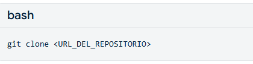

Entra a la carpeta del proyecto recién creada.

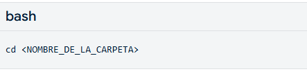

## 2. Instalar las dependencias

Instala todas las herramientas y librerías necesarias con Node.js

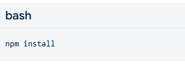

## 3. Ejecutar el servidor de desarrollo

Inicia el entorno local de Vite con el comando

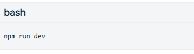

Copia la dirección web local que aparece en la terminal (usualmente http://localhost:5173) y pégala en tu navegador.

## 4. Navegación y uso de la Aplicación

Se detalla el punto de entrada y las pantallas de las funcionalidades de la aplicación

- Login 
usuario: admin
contraseña: admin123
o se registra

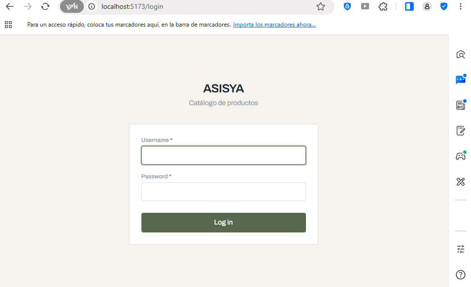

La aplicación luego de hacer login por un usuario autorizado despliega el menu principal y la vista por defecto. "Lista de Productos"

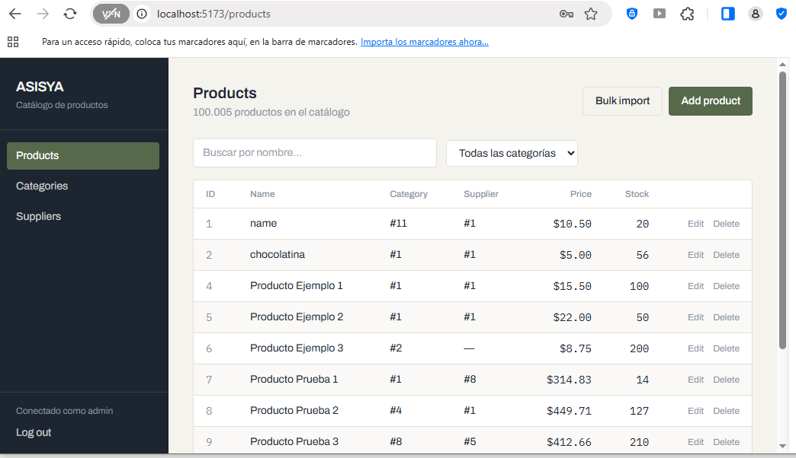

Si hay productos registrados se despliega un listado paginado y con la posibilidad de busqueda y filtros.

- Se presenta la funcionalidad de agregar un producto. El formulario tiene validaciones.

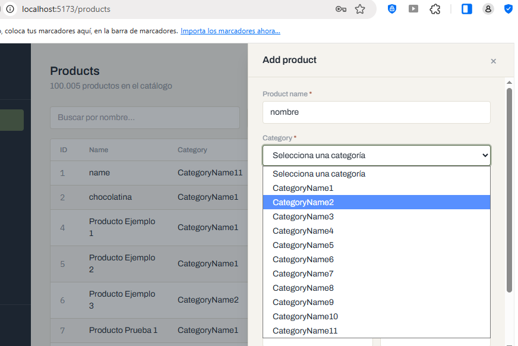

- Ahora se tiene la funcionalidad de "Cargue masivo de archivos".
Se logra procesar 100.000 registros en aproximadamente 7 segundos.

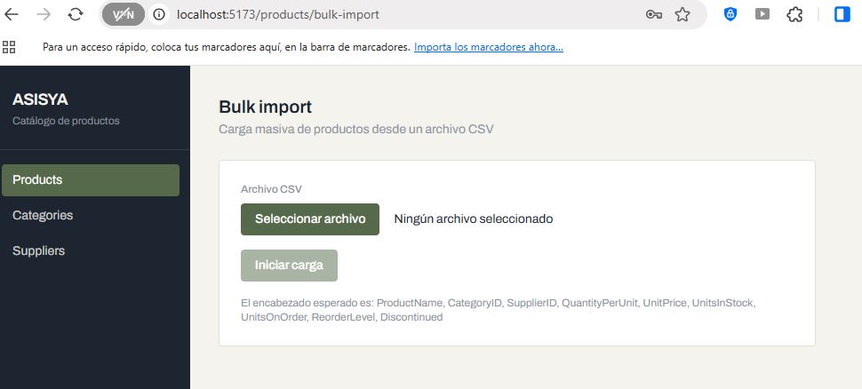

- Funcionalidad de visualización y adición de Categorías

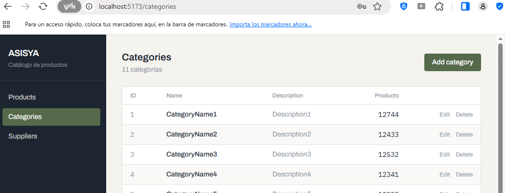

- Funcionalidad para adicionar una Categoría, el formulacion tiene validación de campos

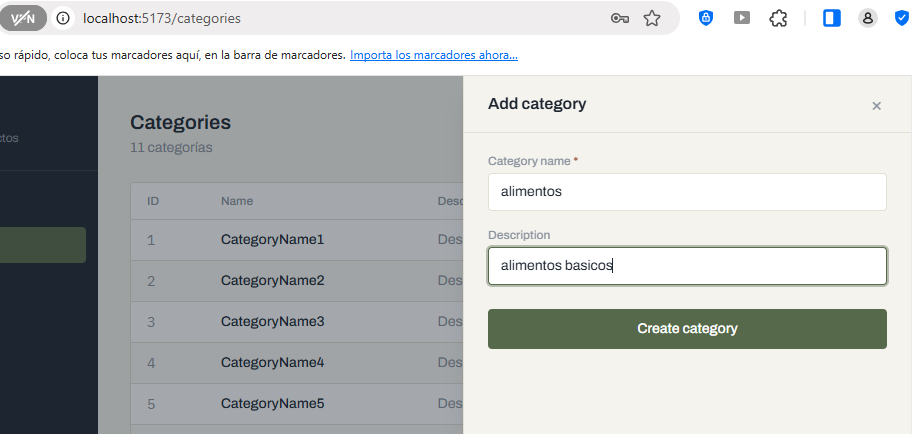

- Los Proveedore "Suppliers" se obserba la lista de suppliers 

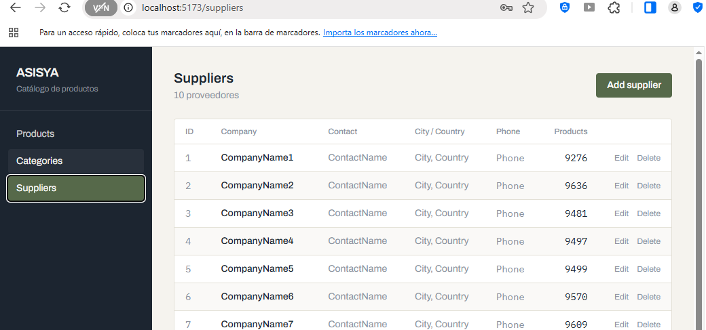

- Los Proveedore tienen la funcionalidad para adicionar un proveedor.

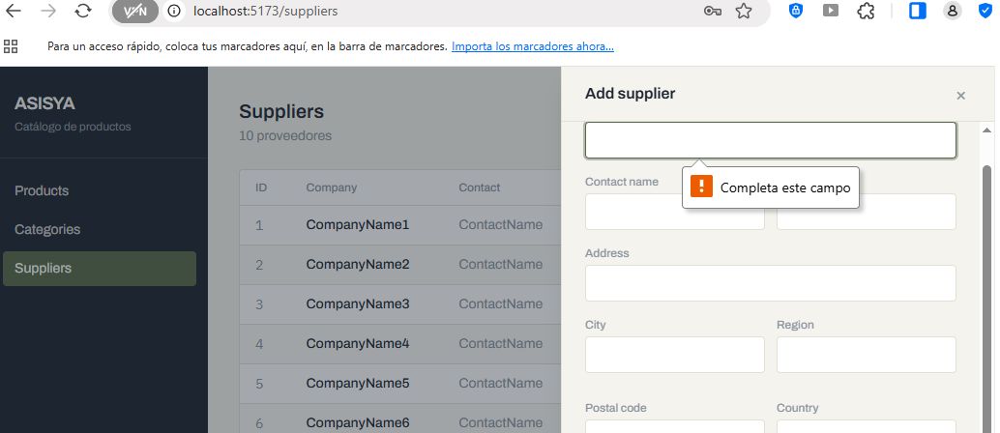

