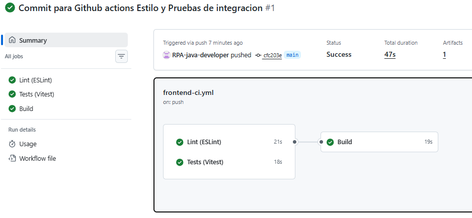
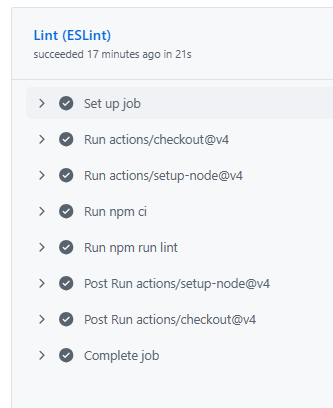
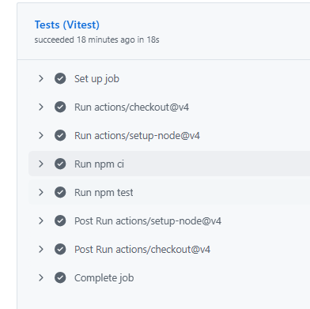
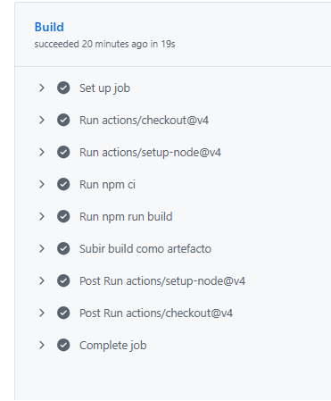

# ASISYA · Frontend

Se realiza un pipeline para pruebas integradas donde se evalua Lint (ESLint) y los test que prueban el componente login formulario si los campos están vacíos y LoginPage: muestra el error del backend con credenciales inválidas.

## Proceso Github Actions

Carpetas del proyecto

Pruebas Lint (exitosas)

Pruebas Test - Vitest (exitosas)

Aquí se realizan las pruebas de integración entre el componente de login y el API del backend

Buld (exitoso)

