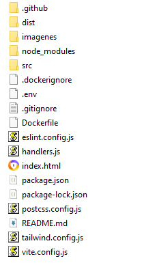

# ASISYA · Frontend

CRUD de Products, Categories y Suppliers consumiendo la API ASISYA (.NET / MySQL).

## Instalación

```bash
npm install
```

## Configuración

Copia `.env.example` a `.env` y ajusta la URL si tu API corre en otro puerto:

```bash
cp .env.example .env
```

Verifica el puerto real de tu backend al correr `dotnet run` (línea "Now
listening on..."). Si usas HTTPS en el backend, ajusta también el
protocolo en `VITE_API_BASE_URL`.

## Habilitar CORS en el backend

Asegúrate de que tu `Program.cs` en ASISYA tenga la política CORS activa
(ya debería estar, la agregamos antes) apuntando a `http://localhost:5173`
o usando `AllowAnyOrigin()` en desarrollo.

## Ejecutar

```bash
npm run dev
```

Abre http://localhost:5173

## Estructura

Carpetas del proyecto


